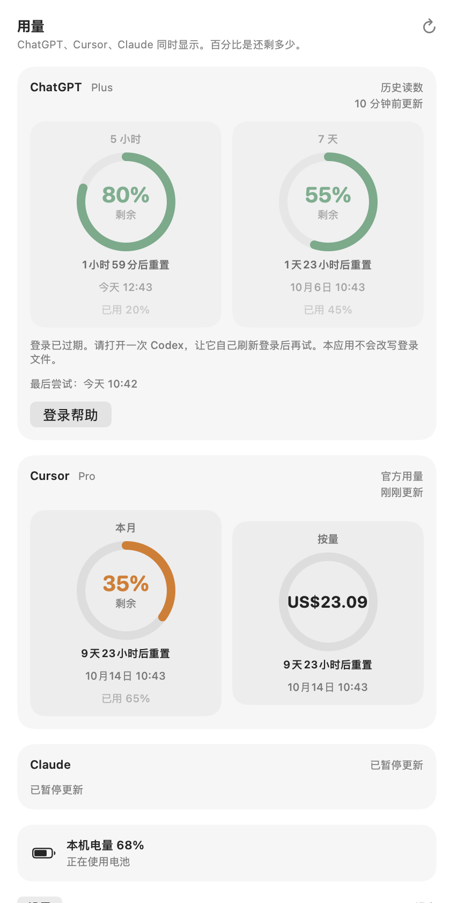

# MacTokenGauge

A macOS menu bar app for ChatGPT, Cursor and Claude quota windows, reset times and battery status. macOS 14 or later; release builds support Apple silicon and Intel.

macOS 菜单栏额度工具，显示 ChatGPT、Cursor、Claude 的额度窗口、重置时间和本机电量。要求 macOS 14 或更高版本，构建包同时支持 Apple 芯片和 Intel。

[Downloads 下载](https://github.com/chen-bliss/MacTokenGauge/releases) · [Changelog](CHANGELOG.md) · [Contributing](CONTRIBUTING.md) · [MIT license](LICENSE)

## Preview

Rendered from the actual SwiftUI panel with synthetic accounts, not live readings. The example shows a historical ChatGPT reading, Cursor quota and uncapped spend, and a paused Claude service.

由实际 SwiftUI 界面使用模拟账户数据渲染，非真实账户读数。示例展示 ChatGPT 历史读数、Cursor 额度与无上限消费，以及暂停的 Claude 服务。



[English preview](docs/panel-en.png) · [Arabic preview](docs/panel-ar.png)

Regenerate with `scripts/preview.sh` on a logged-in Mac with a graphical session. This renders fixtures through an injected loader and reads no service credentials.

## English

### Features and data states

- Enable ChatGPT, Cursor and Claude independently. Manual refresh respects these switches. Paused services retain their last reading in the panel and leave menu bar quota indicators.
- Main ChatGPT limits are parsed from explicit response paths. Additional model limits stay separate and can be chosen as graphic slots.
- The panel labels official, historical, local, unavailable and paused readings. It shows the captured time and, after a failure, the latest attempt and error. In text style, `~` marks a historical or local value, and `?` means no reading. Dashed graphic tracks mean unavailable or non-percentage data; they do not mean exhausted quota. Separate rings mark uncapped amounts with `$`.
- Cursor's monthly quota uses structured included-budget fields before dashboard prose. Auto and API windows remain separate. Capped on-demand usage is a percent; uncapped spend is a currency amount and never enters remaining-quota selection or percentage graphics.
- The headline first finds the minimum remaining quota, then chooses the shortest window within five percentage points of that minimum, breaking ties by remaining quota and stable ID. ChatGPT additional model limits do not replace its main headline.
- Text templates, bars, rings, battery display and six display languages are available. Changes to appearance, notification thresholds and refresh intervals do not issue usage requests.
- Each service publishes when its own request finishes. Cursor remembers a successful endpoint, skips redundant fallback when on-demand is explicitly disabled, and has a 25-second total request budget. HTTP 429 honors Retry-After or uses exponential backoff.
- Low Power Mode slows checks. Exhausted main ChatGPT and Claude short windows can pause polling until reset. Notifications use successful live readings only, once per cycle while quota remains.
- First launch explains local credential access. Settings offers login help, an on-demand update check and diagnostic export. Diagnostics contain only service IDs, state, source, timestamps and counts; no credentials, account identifiers, emails, conversation contents or usage values.

### Install

1. Download a DMG from [Releases](https://github.com/chen-bliss/MacTokenGauge/releases).
2. Verify its checksum against that release's `SHA256SUMS.txt` with `shasum -a 256 -c SHA256SUMS.txt` in the directory containing both the DMG and ZIP. To check only the DMG, use `shasum -a 256 MacTokenGauge-<version>.dmg` and compare its line.
3. Open the DMG and drag MacTokenGauge into Applications. Eject the image and open the app.
4. Choose your services in the first-use screen, then select Get started.

### Free distribution and Gatekeeper

This student project uses **ad hoc signing** and hardened runtime. Building, testing and packaging require no Apple account, Developer ID certificate or paid membership. Packages are **not notarized**. Ad hoc signatures verify bundle integrity locally; they do not establish a developer identity trusted by Gatekeeper. SHA-256 checksums help check downloaded bytes against the release; they do not replace notarization.

If macOS blocks a trusted, checksum-verified copy, first try opening it, then use **System Settings → Privacy & Security → Open Anyway**, as described in [Apple's instructions](https://support.apple.com/en-us/102445). If macOS says the app is damaged, do not assume the warning is harmless: re-download and verify the checksum first.

For a copy you have verified and chosen to trust, an app-specific fallback is:

```bash
xattr -dr com.apple.quarantine /Applications/MacTokenGauge.app
```

This removes that app's download quarantine marker. It does not notarize the app. Do not disable Gatekeeper globally. Developer ID and notarization remain optional future distribution choices; the project's build workflows do not require them. See [Apple's distribution documentation](https://developer.apple.com/documentation/security/notarizing-macos-software-before-distribution).

<a id="service-setup"></a>
### Service setup and login recovery

| Service | Local login source | What is measured | Recovery |
| --- | --- | --- | --- |
| ChatGPT | `CODEX_HOME/auth.json`, normally `~/.codex/auth.json` | Subscription Codex quota returned by the ChatGPT usage endpoint; primary and secondary windows, plus additional model limits when present | Sign in again in the Codex app or CLI, then refresh. An API key alone does not provide subscription quota. |
| Cursor | `~/Library/Application Support/Cursor/User/globalStorage/state.vscdb` | Included monthly budget, Auto, API and optional on-demand spend, depending on the endpoint | Open Cursor and sign in again, then refresh. |
| Claude | `~/.claude/.credentials.json`, `~/.config/claude/credentials.json`, or Claude Code credentials in Keychain | Subscription OAuth usage windows, commonly five hours and seven days | Run Claude Code's login flow again, then refresh. Keychain may ask for permission. An API key alone does not provide these windows. |

The app reads existing credentials and sends each token only to its corresponding provider. It does not rotate refresh tokens, write credential files or send conversations. It reads local Codex JSONL logs only as a fallback: events must explicitly match the current account, be no more than 24 hours old, and have a valid event timestamp. Many logs have no account metadata and are intentionally ignored. A local reading is an estimate from a previous event and does not trigger quota alerts.

On account changes, previous readings and notification-cycle state are discarded. For Claude opaque tokens without a stable subject, token renewal also conservatively discards the old snapshot. Rate-limit errors wait until the indicated retry time; repeated manual refresh does not bypass that delay.

### Build, test and package

Use **Xcode 16 or later** with macOS 14 or later. There are no third-party package dependencies. Open `ChatGPTGauge.xcodeproj`, select My Mac and run with the configured Sign to Run Locally identity. You do not need to select a development team.

```bash
swift test
scripts/package.sh dist
```

Tests use synthetic inputs, temporary logs and injected provider loaders. They do not read real credentials or query provider accounts. The script builds a universal Release app, verifies its signature and architectures, creates and verifies a DMG, creates a ZIP, and writes `SHA256SUMS.txt` and `BUILD-INFO.txt`. Repeated builds use the same procedure; byte-for-byte reproducibility across Xcode versions is not promised.

GitHub Actions runs tests and packaging on pull requests and main. The manual Prepare release workflow produces reviewable artifacts; download them and attach them to a Release after review. No signing secrets are needed. Settings checks the latest stable GitHub release when you request it and offers its download link. Updates are manually installed. No account credentials are sent to GitHub.

### Known limits

Provider endpoints and local credential formats can change. Unknown ChatGPT response structures are rejected explicitly. These are subscription quota indicators, not API token billing. Exhaustion scheduling still uses the known main short windows; model-specific blocking rules require real response validation. The log index is refreshed at most once a minute, scans directories for the 20 newest files, and reads up to 2 MiB per file; files older than that bounded search may be missed. Newly indexed files can take a minute to appear.

Automated tests verify data and scheduling behavior. Multiple displays, Arabic layout, VoiceOver, Keychain prompts and login items still need testing on actual installations. Distribution without notarization can require a manual Gatekeeper exception.

## 中文

### 功能与数据状态

- 分别启用 ChatGPT、Cursor 和 Claude，手动刷新也遵循开关。暂停后，弹窗保留最后读数，菜单栏隐藏该服务的额度指示。
- ChatGPT 主额度按明确路径解析，附加模型额度单独保留，可在图形槽位中选择。
- 弹窗区分“官网数据”“历史读数”“本机记录”“暂无可用数据”和“已暂停更新”，展示采集时间，并在失败后展示最后尝试时间和错误。文字中的 `~` 表示历史或本地读数，`?` 表示没有读数。虚线图形表示暂无可用比例，不等同于额度耗尽。无上限金额在独立环中显示 `$`。
- Cursor 月额度优先采用结构化预算字段，Auto 和 API 分别显示。设置上限的按量消费显示比例，无上限消费显示金额，金额不参与剩余额度选择和百分比绘图。
- 主窗口先确定最低剩余额度，再从“最低值加 5 个百分点”范围内选择较短窗口，最后按余量和稳定 ID 排序。ChatGPT 附加模型额度不会替代主额度标题。
- 支持文字模板、横条、圆环、电量和六种界面语言。外观、通知阈值和刷新间隔的调整不会发起网络查询。
- 各服务完成后独立更新。Cursor 记住可用接口，识别按量消费明确停用的响应，一次查询最多等待 25 秒。收到 429 时遵循 Retry-After，并提供指数退避。
- 低电量模式会降低查询频率。已耗尽的 ChatGPT 和 Claude 主短时窗口可等到重置后再查询。通知只使用成功的实时官网读数，每个周期提醒一次，耗尽后不再提醒。
- 首次启动说明凭据读取位置，设置提供登录帮助、Releases 链接和诊断导出。诊断仅含服务名称、状态、来源、时间和窗口数量，不含凭据、账户标识、邮箱、对话或用量数值。

### 安装与免费发布

在 [Releases](https://github.com/chen-bliss/MacTokenGauge/releases) 下载 DMG，核对该版本的 SHA-256 校验值，打开后将 MacTokenGauge 拖入“应用程序”。推出磁盘映像并启动，在首次使用页面选择服务，再点击“开始使用”。

项目采用 **ad hoc 签名**并开启 Hardened Runtime，构建、测试和打包不需要苹果开发者账号，也不需要购买会员。安装包**未经过 Apple 公证**，因此 macOS 可能拦截首次打开。ad hoc 签名只能用于本地完整性验证，不能证明 Gatekeeper 信任的开发者身份；校验值也不能代替公证。

确认来源可信、校验值匹配后，可以先尝试打开，再进入“系统设置”中的“隐私与安全性”，选择“仍要打开”。操作依据见 [Apple 官方说明](https://support.apple.com/zh-cn/102445)。出现“已损坏”提示时，应先重新下载并核对校验值，不能一概认定提示无害。

对于已核验并决定信任的副本，可使用仅针对该应用的备用操作：

```bash
xattr -dr com.apple.quarantine /Applications/MacTokenGauge.app
```

此命令只移除该应用的下载隔离标记，不会使其获得公证。无需关闭整个系统的 Gatekeeper。付费 Developer ID 签名和公证仅作为未来可选方案，当前工作流不依赖这些条件。

### 接入前提与隐私

ChatGPT 读取 `CODEX_HOME` 下的 `auth.json`，默认位于 `~/.codex`，展示接口返回的订阅 Codex 额度。Cursor 读取其 `globalStorage` 下的 `state.vscdb`。Claude 读取 Claude Code 的本地凭据文件或钥匙串中的登录，需要订阅 OAuth 登录。单独的 API Key 不能提供订阅额度窗口。登录缺失或过期时，请在对应客户端重新登录，再刷新。

应用仅将令牌发给对应服务，不轮换刷新令牌，不修改凭据文件，不发送对话内容。本地 Codex 日志仅作为回退：事件必须明确匹配当前账户，时间有效，且不超过 24 小时。不含账户元数据的日志会被忽略。本机记录代表过去某一时刻的额度，不触发实时额度通知。

切换账户后清理旧读数和通知周期状态。Claude 使用不含稳定账户标识的不透明令牌时，令牌更新也会保守地清理旧读数。限流期间手动刷新不会绕过退避。

### 源码构建与限制

需要 **Xcode 16 或更高版本**、macOS 14 或更高版本。项目不依赖第三方包。打开 `ChatGPTGauge.xcodeproj`，选择“我的 Mac”，按现有本地签名配置运行，不需要选择开发团队。

```bash
swift test
scripts/package.sh dist
```

自动测试使用模拟响应、临时日志和注入的加载器，不读取真实凭据，也不查询真实账户。打包脚本生成 Apple 芯片与 Intel 通用构建，检查签名、架构和磁盘映像，并输出 ZIP、SHA-256 校验值及构建信息。GitHub Actions 在 PR 和 main 上运行验证，手动发布工作流提供待审核构建产物。

接口和本地登录格式可能变化。未知 ChatGPT 响应结构会明确报错。耗尽暂停仍基于已知主短时窗口，更多模型的限制规则需用真实响应验证。日志索引每分钟最多更新一次，读取最近 20 个文件，每个最多 2 MiB，因此可能遗漏搜索范围以外的日志。设置可在用户点击时查询 GitHub 最新稳定版本并提供下载链接，不向 GitHub 发送账户凭据。更新仍由用户手动安装。

多显示器、阿拉伯语布局、VoiceOver、钥匙串授权和开机启动仍需在实际安装环境验收。完整变更和贡献方法见 [CHANGELOG](CHANGELOG.md) 与 [CONTRIBUTING](CONTRIBUTING.md)。
